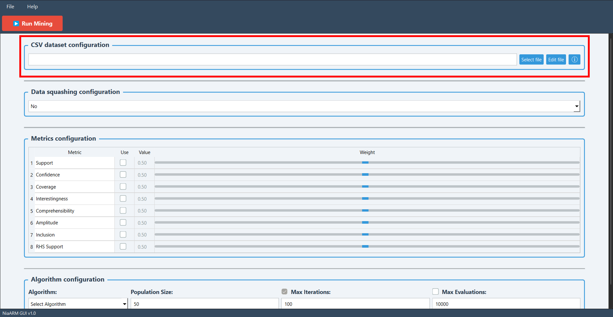
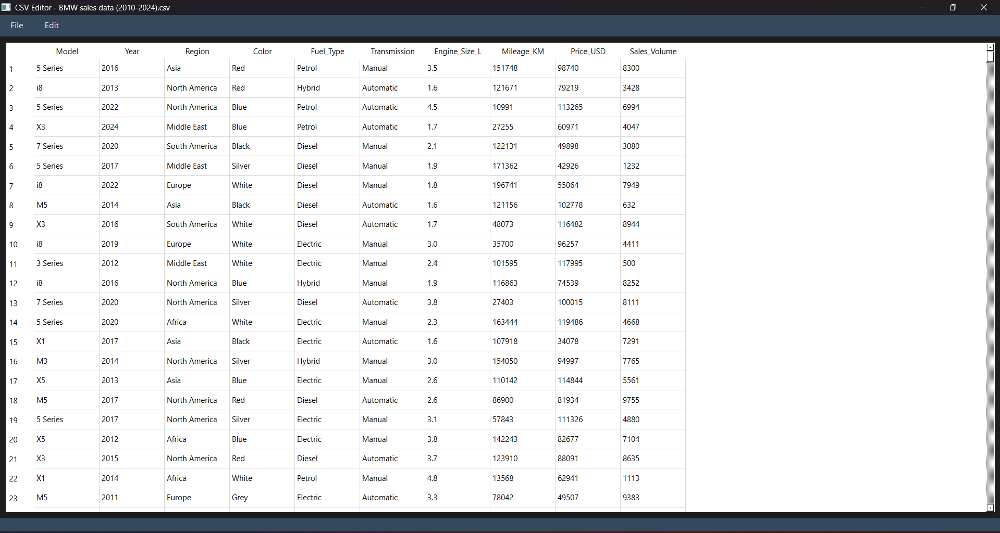
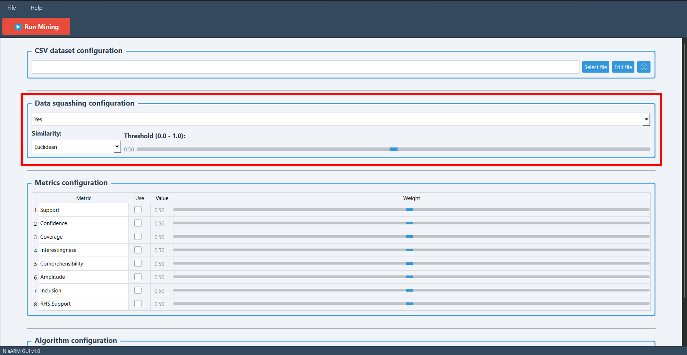
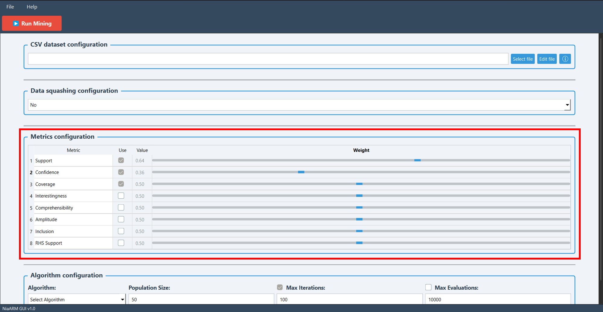
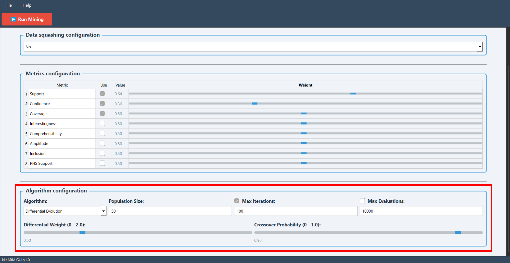
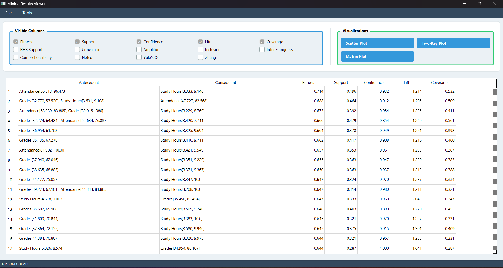

<p align="center">
  
</p>

<h1 align="center">NiaARM GUI</h1>

<h2 align="center">
  A graphical user interface for numerical association rule mining
</h2>
<p align="center">
  <a href="https://github.com/firefly-cpp/NiaARM-GUI/blob/main/LICENSE"></a>
  
  
  <a href="https://github.com/firefly-cpp/NiaARM"></a>
</p>

NiaARM GUI brings the NiaARM framework to a desktop application. It lets users load and edit datasets, run the mining process, and explore the resulting rules.

## About

This GUI was developed as part of a diploma thesis at the Faculty of Electrical Engineering and Computer Science, University of Maribor.

**Author:** Dario Zadravec  
**Supervisors:** Iztok Fister Jr.; Tilen Hliš  
**Year:** 2026

## Features

- Interactive GUI for configuring association rule mining
- Support for multiple optimization algorithms:
  - Differential Evolution
  - Particle Swarm Optimization
  - Genetic Algorithm
  - Bat Algorithm
  - Firefly Algorithm
- Data preprocessing with data squashing
- CSV dataset editor
- Results visualization (scatter plot, grouped matrix plot, two-key plot)
- Rule filtering and export

## Installation

Using pip:
```sh
pip install git+https://github.com/firefly-cpp/NiaARM-GUI.git
```

## Usage

After successful installation run:
```sh
niaarm-gui
```

If `niaarm-gui` is not recognized after installation, make sure Python's Scripts
directory is on your PATH, or run the app as:
```sh
python -m niaarm_gui.main
```

### Loading a dataset

Select a CSV file through the CSV dataset configuration section. The file
path appears in the input field, and the status bar confirms once it has
loaded successfully.

<p align="center">
  
</p>

### Editing a dataset

Click **Edit file** to open the built-in CSV editor. It displays the dataset
in a table and supports adding or removing rows and columns, editing
individual cells, and saving changes back to the file or to a new location.
Unsaved changes are detected automatically, and the table can be reset to its
original state at any time.

<p align="center">
  
</p>

### Preprocessing with data squashing

The **Data squashing configuration** section reduces dataset size by merging
similar transactions, using either Euclidean or cosine similarity. A
threshold slider controls the minimum similarity required to merge two
transactions; lower values merge more aggressively and produce fewer, more
general transactions, while higher values keep more of the dataset's
original detail. Squashing runs automatically
before mining, and the loading dialog reports the resulting reduction once
it's done.

<p align="center">
  
</p>

### Configuring metrics

The **Metrics configuration** section lets you choose which of eight
available metrics — support, confidence, coverage, interestingness,
comprehensibility, amplitude, inclusion, and RHS support — are used to
evaluate rule quality. Each selected metric gets a weight between 0 and 1;
higher weights carry more influence on the fitness function used during
optimization. At least one metric must be selected to start mining.

<p align="center">
  
</p>

### Selecting and configuring an algorithm

Choose one of five optimization algorithms — Differential Evolution,
Particle Swarm Optimization, Genetic Algorithm, Bat Algorithm, or Firefly
Algorithm — in the **Algorithm configuration** section. Population size
applies to all algorithms, alongside two independent stopping criteria —
max iterations and max evaluations — each toggled on or off with
its own checkbox. At least one must be enabled; if both are enabled, mining
stops as soon as either limit is reached. Algorithm-specific parameters
appear dynamically based on the current selection. Default values work well
for users unfamiliar with a given algorithm's tuning.

<p align="center">
  
</p>

### Reviewing, visualizing, and exporting results

Once mining completes, the **Mining Results Viewer** displays the discovered
rules in a sortable, filterable table. Filtering supports setting minimum
values across any combination of metrics, and the status bar reports how
many rules match the current filter.

<p align="center">
  
</p>

Results can also be explored visually through three techniques available
from the toolbar: a **scatter plot** comparing two chosen metrics, a
**grouped matrix plot** clustering similar antecedents, and a **two-key
plot** showing rules as a network of connected nodes. All three support
interactive zooming, panning, and hover tooltips.

Rules can be exported to CSV via **File → Save** or **Save As** in the
results viewer, including all rule attributes, metric values, and the
current sort order. Previously exported results can be reopened from the
main window's **File → Open saved results**, without rerunning the mining
process.

## License

This package is distributed under the MIT License. This license can be found online at <http://www.opensource.org/licenses/MIT>.